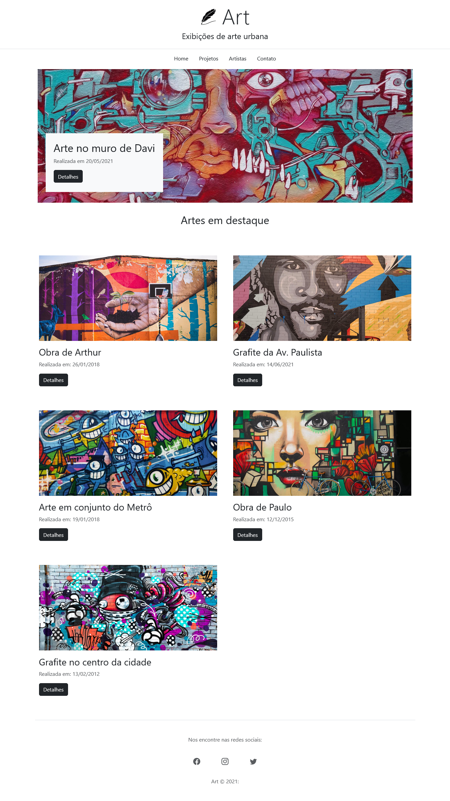
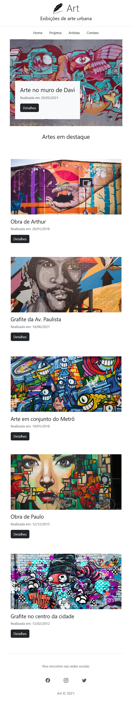

# Art

This website is a single-page application called Art that displays urban art content in a simple and organized way.
The main goal of the project is to present visual artworks using a clean layout and responsive design.

The application was built with ReactJS and Vite, focusing on performance and simplicity, and uses Bootstrap to ensure basic responsiveness and layout structure.

---

## 📷 Screenshots

### Desktop


### Mobile


---

## 🚀 Technologies

- React

- Bootstrap

- Vite

---

## 📦 How to use

1. Clone the repository:
```bash
git clone https://github.com/michaelprocha/art
```

2. Dowloand [NodeJS](https://nodejs.org/en/download).

3. Install dependencies:
```bash
npm install
```

4. Run locally
```bash
npm run dev
```

---

## 👨‍💻 Author

Made by [Michael Rocha](https://github.com/michaelprocha)

---

## 📄 License

This project is licensed under the MIT License. See the LICENSE file for more details.